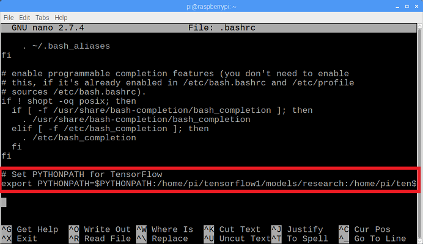
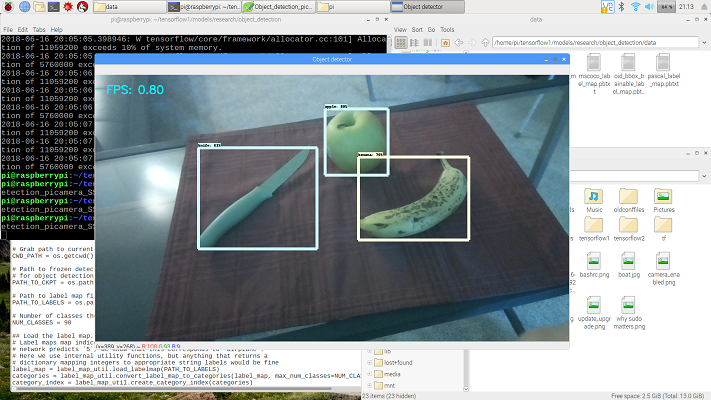
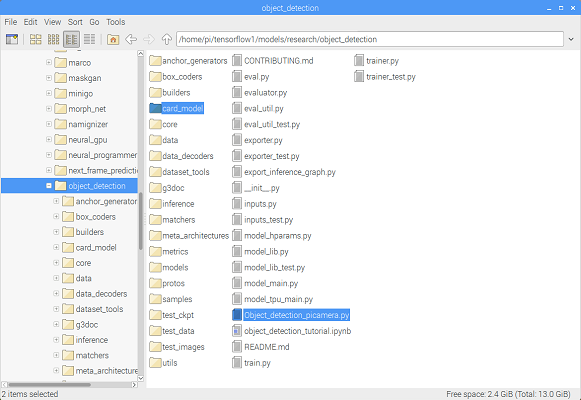
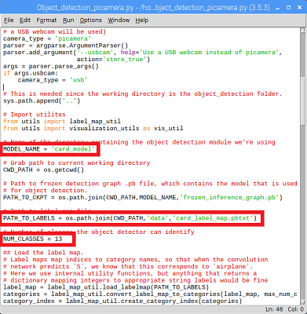
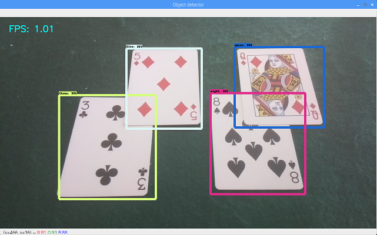
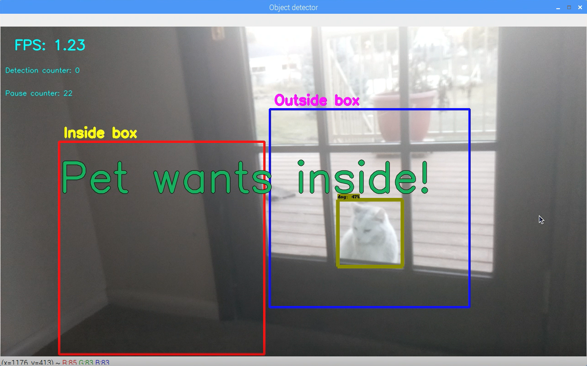

# Tutorial to set up TensorFlow Object Detection API on the Raspberry Pi


<p align="center">
  
</p>

*Update 10/13/19:* Setting up the TensorFlow Object Detection API on the Pi is much easier now! Two major updates: 1) TensorFlow can be installed simply using "pip3 install tensorflow". 2) The protobuf compiler (protoc) can be installed using "sudo apt-get protobuf-compiler. I have updated Step 3 and Step 4 to reflect these changes.

Bonus: I made a Pet Detector program (Pet_detector.py) that sends me a text when it detects when my cat wants to be let outside! It runs on the Raspberry Pi and uses the TensorFlow Object Detection API. You can use the code as an example for your own object detection applications. More info is available at [the bottom of this readme](https://github.com/EdjeElectronics/TensorFlow-Object-Detection-on-the-Raspberry-Pi#bonus-pet-detector).

## Introduction
This guide provides step-by-step instructions for how to set up TensorFlow’s Object Detection API on the Raspberry Pi. By following the steps in this guide, you will be able to use your Raspberry Pi to perform object detection on live video feeds from a Picamera or USB webcam. Combine this guide with my <link> tutorial on how to train your own neural network to identify specific objects</link>, and you use your Pi for unique detection applications such as:

* Detecting if bunnies are in your garden eating your precious vegetables
* Telling you if there are any parking spaces available in front of your apartment building
* [Beehive bee counter](http://matpalm.com/blog/counting_bees/)
* [Counting cards at the blackjack table](https://hackaday.io/project/27639-rainman-20-blackjack-robot)
* And anything else you can think of!

Here's a YouTube video I made that walks through this guide!

[](https://www.youtube.com/watch?v=npZ-8Nj1YwY)

The guide walks through the following steps:
1. [Update the Raspberry Pi](https://github.com/EdjeElectronics/TensorFlow-Object-Detection-on-the-Raspberry-Pi#1-update-the-raspberry-pi)
2. [Install TensorFlow](https://github.com/EdjeElectronics/TensorFlow-Object-Detection-on-the-Raspberry-Pi#2-install-tensorflow)
3. [Install OpenCV](https://github.com/EdjeElectronics/TensorFlow-Object-Detection-on-the-Raspberry-Pi#3-install-opencv)
4. [Compile and install Protobuf](https://github.com/EdjeElectronics/TensorFlow-Object-Detection-on-the-Raspberry-Pi#4-compile-and-install-protobuf)
5. [Set up TensorFlow directory structure and the PYTHONPATH variable](https://github.com/EdjeElectronics/TensorFlow-Object-Detection-on-the-Raspberry-Pi#5-set-up-tensorflow-directory-structure-and-pythonpath-variable)
6. [Detect objects!](https://github.com/EdjeElectronics/TensorFlow-Object-Detection-on-the-Raspberry-Pi#6-detect-objects)
7. [Bonus: Pet detector!](https://github.com/EdjeElectronics/TensorFlow-Object-Detection-on-the-Raspberry-Pi#bonus-pet-detector)

The repository also includes the Object_detection_picamera.py script, which is a Python script that loads an object detection model in TensorFlow and uses it to detect objects in a Picamera video feed. The guide was written for TensorFlow v1.8.0 on a Raspberry Pi Model 3B running Raspbian Stretch v9. It will likely work for newer versions of TensorFlow.

## Steps
### 1. Update the Raspberry Pi
First, the Raspberry Pi needs to be fully updated. Open a terminal and issue:
```
sudo apt-get update
sudo apt-get dist-upgrade
```
Depending on how long it’s been since you’ve updated your Pi, the upgrade could take anywhere between a minute and an hour.

<p align="center">
  
</p>

### 2. Install TensorFlow
*Update 10/13/19: Changed instructions to just use "pip3 install tensorflow" rather than getting it from lhelontra's repository. The old instructions have been moved to this guide's appendix.*

Next, we’ll install TensorFlow. The download is rather large (over 100MB), so it may take a while. Issue the following command:

```
pip3 install tensorflow
```

TensorFlow also needs the LibAtlas package. Install it by issuing the following command. (If this command doesn't work, issue "sudo apt-get update" and then try again).
```
sudo apt-get install libatlas-base-dev
```
While we’re at it, let’s install other dependencies that will be used by the TensorFlow Object Detection API. These are listed on the [installation instructions](https://github.com/tensorflow/models/blob/master/research/object_detection/g3doc/installation.md) in TensorFlow’s Object Detection GitHub repository. Issue:
```
sudo pip3 install pillow lxml jupyter matplotlib cython
sudo apt-get install python-tk
```
Alright, that’s everything we need for TensorFlow! Next up: OpenCV.

### 3. Install OpenCV
TensorFlow’s object detection examples typically use matplotlib to display images, but I prefer to use OpenCV because it’s easier to work with and less error prone. The object detection scripts in this guide’s GitHub repository use OpenCV. So, we need to install OpenCV.

To get OpenCV working on the Raspberry Pi, there’s quite a few dependencies that need to be installed through apt-get. If any of the following commands don’t work, issue “sudo apt-get update” and then try again. Issue:
```
sudo apt-get install libjpeg-dev libtiff5-dev libjasper-dev libpng12-dev
sudo apt-get install libavcodec-dev libavformat-dev libswscale-dev libv4l-dev
sudo apt-get install libxvidcore-dev libx264-dev
sudo apt-get install qt4-dev-tools libatlas-base-dev
```
Now that we’ve got all those installed, we can install OpenCV. Issue:
```
sudo pip3 install opencv-python
```
Alright, now OpenCV is installed!

### 4. Compile and Install Protobuf
The TensorFlow object detection API uses Protobuf, a package that implements Google’s Protocol Buffer data format. You used to need to compile this from source, but now it's an easy install! I moved the old instructions for compiling and installing it from source to the appendix of this guide.

```sudo apt-get install protobuf-compiler```

Run `protoc --version` once that's done to verify it is installed. You should get a response of `libprotoc 3.6.1` or similar.

### 5. Set up TensorFlow Directory Structure and PYTHONPATH Variable
Now that we’ve installed all the packages, we need to set up the TensorFlow directory. Move back to your home directory, then make a directory called “tensorflow1”, and cd into it.
```
mkdir tensorflow1
cd tensorflow1
```
Download the tensorflow repository from GitHub by issuing:
```
git clone --depth 1 https://github.com/tensorflow/models.git
```
Next, we need to modify the PYTHONPATH environment variable to point at some directories inside the TensorFlow repository we just downloaded. We want PYTHONPATH to be set every time we open a terminal, so we have to modify the .bashrc file. Open it by issuing:
```
sudo nano ~/.bashrc
```
Move to the end of the file, and on the last line, add:
```
export PYTHONPATH=$PYTHONPATH:/home/pi/tensorflow1/models/research:/home/pi/tensorflow1/models/research/slim
```

<p align="center">
  
</p>

Then, save and exit the file. This makes it so the “export PYTHONPATH” command is called every time you open a new terminal, so the PYTHONPATH variable will always be set appropriately. Close and then re-open the terminal.

Now, we need to use Protoc to compile the Protocol Buffer (.proto) files used by the Object Detection API. The .proto files are located in /research/object_detection/protos, but we need to execute the command from the /research directory. Issue:
```
cd /home/pi/tensorflow1/models/research
protoc object_detection/protos/*.proto --python_out=.
```
This command converts all the "name".proto files to "name_pb2".py files. Next, move into the object_detection directory:
```
cd /home/pi/tensorflow1/models/research/object_detection
```
Now, we’ll download the SSD_Lite model from the [TensorFlow detection model zoo](https://github.com/tensorflow/models/blob/master/research/object_detection/g3doc/detection_model_zoo.md). The model zoo is Google’s collection of pre-trained object detection models that have various levels of speed and accuracy. The Raspberry Pi has a weak processor, so we need to use a model that takes less processing power. Though the model will run faster, it comes at a tradeoff of having lower accuracy. For this tutorial, we’ll use SSDLite-MobileNet, which is the fastest model available. 

Google is continuously releasing models with improved speed and performance, so check back at the model zoo often to see if there are any better models.

Download the SSDLite-MobileNet model and unpack it by issuing:
```
wget http://download.tensorflow.org/models/object_detection/ssdlite_mobilenet_v2_coco_2018_05_09.tar.gz
tar -xzvf ssdlite_mobilenet_v2_coco_2018_05_09.tar.gz
```
Now the model is in the object_detection directory and ready to be used.

### 6. Detect Objects!
Okay, now everything is set up for performing object detection on the Pi! The Python script in this repository, Object_detection_picamera.py, detects objects in live feeds from a Picamera or USB webcam. Basically, the script sets paths to the model and label map, loads the model into memory, initializes the Picamera, and then begins performing object detection on each video frame from the Picamera. 

If you’re using a Picamera, make sure it is enabled in the Raspberry Pi configuration menu.

<p align="center">
  
</p>

Download the Object_detection_picamera.py file into the object_detection directory by issuing:
```
wget https://raw.githubusercontent.com/EdjeElectronics/TensorFlow-Object-Detection-on-the-Raspberry-Pi/master/Object_detection_picamera.py
```
Run the script by issuing: 
```
python3 Object_detection_picamera.py 
```
The script defaults to using an attached Picamera. If you have a USB webcam instead, add --usbcam to the end of the command:
```
python3 Object_detection_picamera.py --usbcam
```
Once the script initializes (which can take up to 30 seconds), you will see a window showing a live view from your camera. Common objects inside the view will be identified and have a rectangle drawn around them. 

<p align="center">
  
</p>

With the SSDLite model, the Raspberry Pi 3 performs fairly well, achieving a frame rate higher than 1FPS. This is fast enough for most real-time object detection applications.

You can also use a model you trained yourself [(here's a guide that shows you how to train your own model)](https://www.youtube.com/watch?v=Rgpfk6eYxJA) by adding the frozen inference graph into the object_detection directory and changing the model path in the script. You can test this out using my playing card detector model (transferred from ssd_mobilenet_v2 model and trained on TensorFlow v1.5) located at [this dropbox link](https://www.dropbox.com/s/27avwicywbq68tx/card_model.zip?dl=0). Once you’ve downloaded and extracted the model, or if you have your own model, place the model folder into the object_detection directory. Place the label_map.pbtxt file into the object_detection/data directory.

<p align="center">
  
</p>

Then, open the Object_detection_picamera.py script in a text editor. Go to the line where MODEL_NAME is set and change the string to match the name of the new model folder. Then, on the line where PATH_TO_LABELS is set, change the name of the labelmap file to match the new label map. Change the NUM_CLASSES variable to the number of classes your model can identify.

<p align="center">
  
</p>

Now, when you run the script, it will use your model rather than the SSDLite_MobileNet model. If you’re using my model, it will detect and identify any playing cards dealt in front of the camera.

**Note: If you plan to run this on the Pi for extended periods of time (greater than 5 minutes), make sure to have a heatsink installed on the Pi's main CPU! All the processing causes the CPU to run hot. Without a heatsink, it will shut down due to high temperature.**

<p align="center">
  
</p>

Thanks for following through this guide, I hope you found it useful. Good luck with your object detection applications on the Raspberry Pi!

## Bonus: Pet Detector!

<p align="center">
  
</p>

### Description
The Pet_detector.py script is an example application of using object detection on the API to alert users when a certain object is detected. I have two indoor-outdoor pets at my parents' home: a cat and a dog. They frequently stand at the door and wait patiently to be let inside or outside. This pet detector uses the TensorFlow MobileNet-SSD model to detect when they are near the door. It defines two regions in the image, an "inside" region and an "outside" region. If the pet is detected in either region for at least 10 consecutive frames, the script uses Twilio to send my phone a text message.

Here's a YouTube video demonstrating the pet detector and explaining how it works!

[](https://youtu.be/gGqVNuYol6o)

### Usage
Run the pet detector by downloading Pet_detector.py to your /object_detection directory and issuing:
```
python3 Pet_detector.py
```

Using the Pet_detector.py program requires having a Twilio account set up [(see tutorial here)](https://www.twilio.com/docs/sms/quickstart/python). It also uses four environment variables that have to be set before running the program: TWILIO_ACCOUNT_SID, TWILIO_AUTH_TOKEN, MY_DIGITS, and TWILIO_DIGITS. These can be set using the "export" command, as shown below. More information on setting environment variables for Twilio is given [here](https://www.twilio.com/blog/2017/01/how-to-set-environment-variables.html).
```
export TWILIO_ACCOUNT_SID=[sid_value]
export TWILIO_AUTH_TOKEN=[auth_token]
export MY_DIGITS=[your cell phone number]
export TWILIO_DIGITS=[phone number of the Twilio account]
```
The sid_value, auth_token, and phone number of the Twilio account values are all provided when a Twilio account is set up.

If you don't want to bother with setting up Twilio so the pet detector can send you texts, you can just comment out the lines in the code that use the Twilio library. The detector will still display a message on the screen when your pet wants inside or outside.

Also, you can move the locations of the "inside" and "outside" boxes by adjusting the TL_inside, BR_inside, TL_outside, and BR_outside variables.

## Appendix

### Old instructions for installing TensorFlow
These instructions show how to install TensorFlow using lhelontra's repository. They were replaced in my 10/13/19 update of this guide. I am keeping them here, because these are the instructions used in my [video](https://www.youtube.com/watch?v=npZ-8Nj1YwY).

In the /home/pi directory, create a folder called ‘tf’, which will be used to hold all the installation files for TensorFlow and Protobuf, and cd into it:
```
mkdir tf
cd tf
```
A pre-built, Rapsberry Pi-compatible wheel file for installing the latest version of TensorFlow is available in the [“TensorFlow for ARM” GitHub repository](https://github.com/lhelontra/tensorflow-on-arm/releases). GitHub user lhelontra updates the repository with pre-compiled installation packages each time a new TensorFlow is released. Thanks lhelontra!  Download the wheel file by issuing:
```
wget https://github.com/lhelontra/tensorflow-on-arm/releases/download/v1.8.0/tensorflow-1.8.0-cp35-none-linux_armv7l.whl
```
At the time this tutorial was written, the most recent version of TensorFlow was version 1.8.0. If a more recent version is available on the repository, you can download it rather than version 1.8.0.

Alternatively, if the owner of the GitHub repository stops releasing new builds, or if you want some experience compiling Python packages from source code, you can check out my video guide: [How to Install TensorFlow from Source on the Raspberry Pi](https://youtu.be/WqCnW_2XDw8), which shows you how to build and install TensorFlow from source on the Raspberry Pi.

[](https://www.youtube.com/watch?v=WqCnW_2XDw8)

Now that we’ve got the file, install TensorFlow by issuing:
```
sudo pip3 install /home/pi/tf/tensorflow-1.8.0-cp35-none-linux_armv7l.whl
```
TensorFlow also needs the LibAtlas package. Install it by issuing (if this command doesn't work, issue "sudo apt-get update" and then try again):
```
sudo apt-get install libatlas-base-dev
```
While we’re at it, let’s install other dependencies that will be used by the TensorFlow Object Detection API. These are listed on the [installation instructions](https://github.com/tensorflow/models/blob/master/research/object_detection/g3doc/installation.md) in TensorFlow’s Object Detection GitHub repository. Issue:
```
sudo pip3 install pillow lxml jupyter matplotlib cython
sudo apt-get install python-tk
```
TensorFlow is now installed and ready to go!

### Old instructions for compiling and installing Protobuf from source
These are the old instructions from Step 4 showing how to compile and install Protobuf from source. These were replaced in the 10/13/19 update of this guide.

The TensorFlow object detection API uses Protobuf, a package that implements Google’s Protocol Buffer data format. Unfortunately, there’s currently no easy way to install Protobuf on the Raspberry Pi. We have to compile it from source ourselves and then install it. Fortunately, a [guide](http://osdevlab.blogspot.com/2016/03/how-to-install-google-protocol-buffers.html) has already been written on how to compile and install Protobuf on the Pi. Thanks OSDevLab for writing the guide!

First, get the packages needed to compile Protobuf from source. Issue:
```
sudo apt-get install autoconf automake libtool curl
```
Then download the protobuf release from its GitHub repository by issuing:
```
wget https://github.com/google/protobuf/releases/download/v3.5.1/protobuf-all-3.5.1.tar.gz
```
If a more recent version of protobuf is available, download that instead. Unpack the file and cd into the folder:
```
tar -zxvf protobuf-all-3.5.1.tar.gz
cd protobuf-3.5.1
```
Configure the build by issuing the following command (it takes about 2 minutes):
```
./configure
```
Build the package by issuing:
```
make
```
The build process took 61 minutes on my Raspberry Pi. When it’s finished, issue:
```
make check 
```
This process takes even longer, clocking in at 107 minutes on my Pi. According to other guides I’ve seen, this command may exit out with errors, but Protobuf will still work. If you see errors, you can ignore them for now. Now that it’s built, install it by issuing:
```
sudo make install
```
Then move into the python directory and export the library path:
```
cd python
export LD_LIBRARY_PATH=../src/.libs
```
Next, issue:
```
python3 setup.py build --cpp_implementation 
python3 setup.py test --cpp_implementation
sudo python3 setup.py install --cpp_implementation
```
Then issue the following path commands:
```
export PROTOCOL_BUFFERS_PYTHON_IMPLEMENTATION=cpp
export PROTOCOL_BUFFERS_PYTHON_IMPLEMENTATION_VERSION=3
```
Finally, issue:
```
sudo ldconfig
```
That’s it! Now Protobuf is installed on the Pi. Verify it’s installed correctly by issuing the command below and making sure it puts out the default help text.
```
protoc
```
For some reason, the Raspberry Pi needs to be restarted after this process, or TensorFlow will not work. Go ahead and reboot the Pi by issuing:
```
sudo reboot now
```

Protobuf should now be installed!
